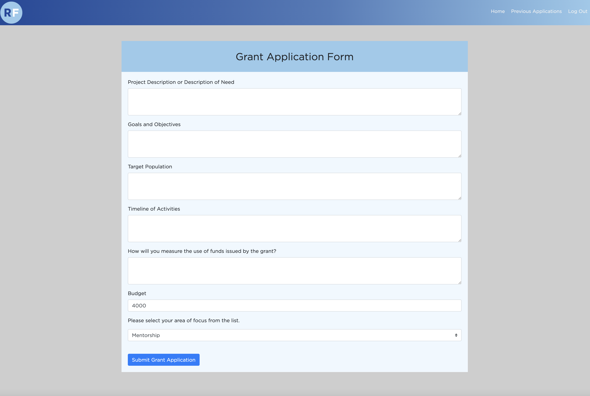
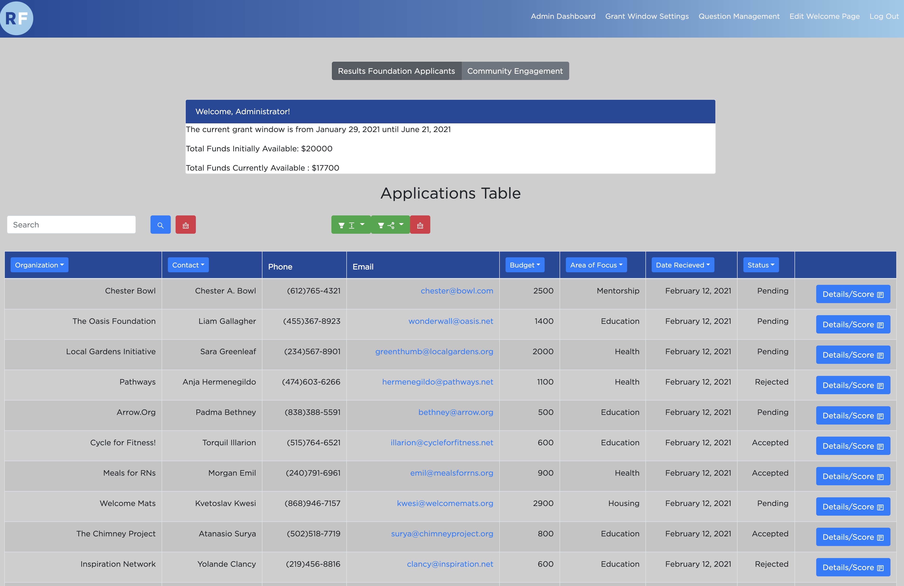
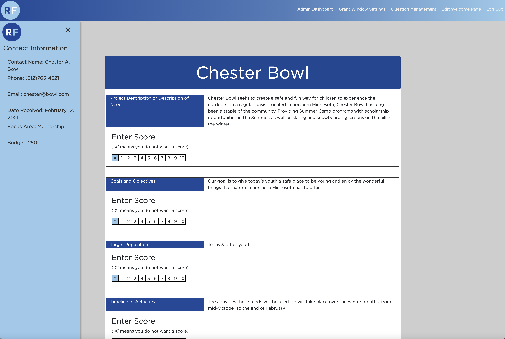
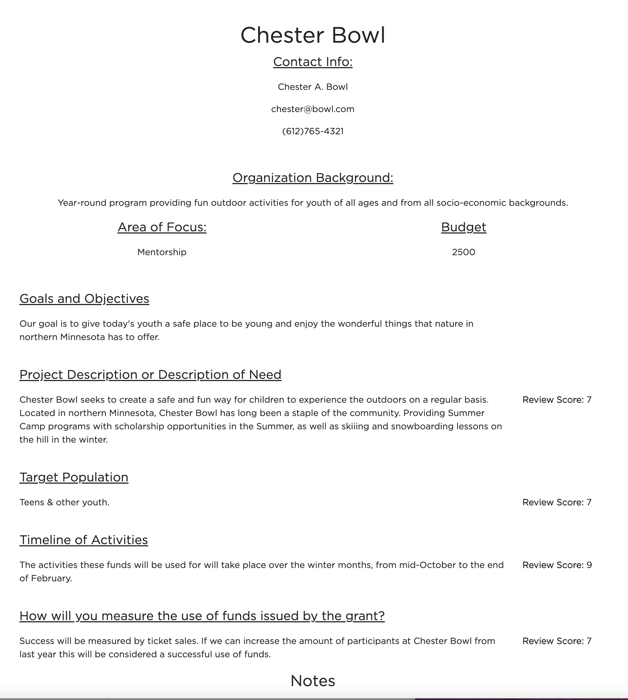
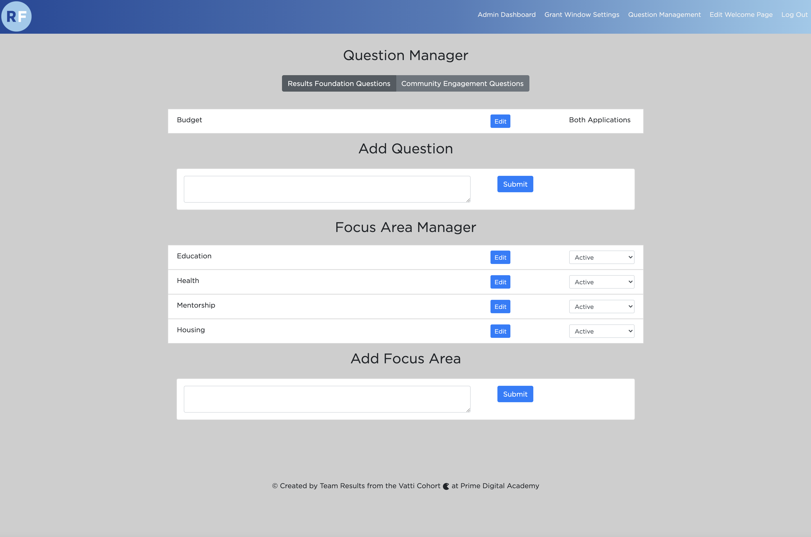
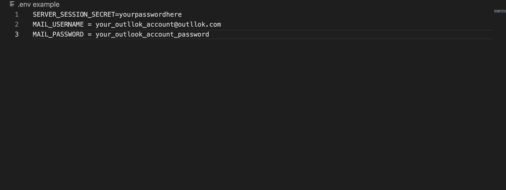

# Results Foundation Application Management Portal
  
## Description

  This software collects applications for the RE/MAX Results Foundation grant and gives the Results Foundation staff the ability to organize, review and present incoming applications. 

  The client side of the applicaiton allows applicants to log in or register their and their orgnaization's information if they have not registered already. From login on the client side, users may fill out and submit a grant application form. Once they have submitted a form, they will be directed to a page that will notify them that their applicaiton was recieved and provide them information about the current grant window.  

## Screen Shots

### Client Side

#### Grant Appliacation Form

### Administration Side

#### Applications Management Table

#### Application Details Page

#### Printable Application Report

#### Grant Application Question Manager

## Installation

### Instructions
1. Fork and clone the repository from gitHub
2. Create a database named `results` in postgreSQL
3. Copy the queries in database.sql into a postreSQL management app like pgAdmin or Postico
4. From terminal, navigate to the folder where you pulled the repository down.
5. Enter `npm install` at the command line
6. If you do not already have one, make an email acocunt with [Microsoft Outlook](https://outlook.live.com/owa/). 
7. Create a new file in the root folder named '.env'
8. In the first line of the .env file, make a password by writing the line `SERVER_SESSION_SECRET=[yourpasswordhere]` (Note: the brackets are to point out "yourpasswordhere" is a placeholder, do not use the brackets when setting your password in the actual file. The password in the brackets *must be at least 8 characters long*.
9. In the next line of the .env file, under the line with SERVER_SESSIN_SECET, make a line that says `MAIL_USERNAME= [your_outlook_account]` (see note about the brackets in step 8). 
10. In the next line of the .env file, make a line that says, `MAIL_PASSWORD = [your_email_password]`. (see above notes on brackets) When you are finished, the .env file should look like this:  

11. At the command line, enter 'npm run server'
12. Open another terminal window, and navigate to the repo folder
13. At the command line, enter 'npm run client'
14. Open the application on your web browser (this may happen automatically) at the address `localhost:3000`

## Built With
- HTML
- CSS
- javascript
- node.js
- express
- passport
- postgreSQL
- React
- Redux
- Redux Saga Middleware
- SweetAlert
- React-Bootstrap
- Styled Components
- Moment.js
- React Icons

## Acknowledgment

 This application was initially desinged as a the final project by Team Results Foundation of the Vatti Cohort of [Prime Digital Academy](https://primeacademy.io/) (Class of February '22). 

 ### Team Results Foundation
- [Julian Booher](https://github.com/julianbooher)
- [Lara Lesar](https://github.com/laramaurine)
- [Steven Maloney](https://github.com/sdeda1us)
- [Jordan Newberry](https://github.com/jordanNewberry21)

We would like to thank our client Blaire Molitor for her direction and support in making this project.

We would like to also thank Prime Digital Academy, our colleagues in the Vatti Cohort, and our primary insructor, [Mary Mosman](https://github.com/mbmosman).

## Support

If you have suggestions or issues, please reach out via email to: [julianjbooher@gmail.com](mailto: julianjbooher@gmail.com), [lara.m.lesar@gmail.com](mailto: lara.m.lesar@gmail.com), [steven.maloney@gmail.com](mailto: steven.maloney@gmail.com), [jordan.newberry@gmail.com](mailto: jordan.newberry@gmail.com). 